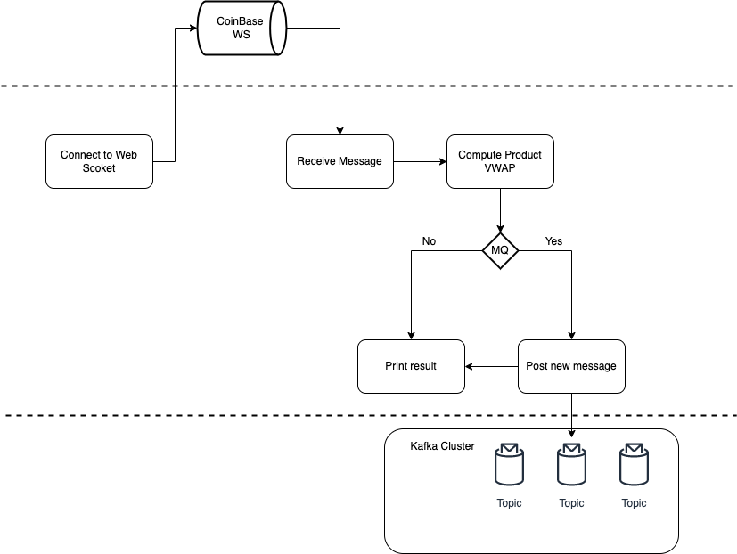
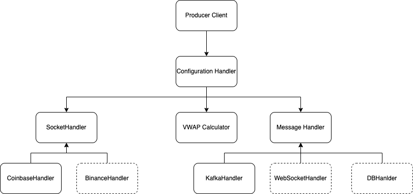
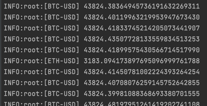
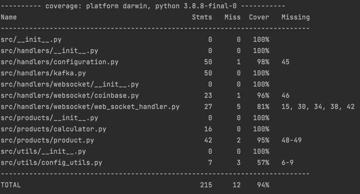

# Volume Weighted Average Price - CoinBase WebSocket

## Description

This project aims to create a real-time VWAP (volume-weighted average price) calculation engine. You
will use the coinbase WebSocket feed to stream in trade executions and update the VWAP for each trading pair
as updates become available.

Retrieve a data feed from the coinbase WebSocket and subscribe to the matches channel. Pull data for
the following three trading pairs:
- BTC-USD
- ETH-USD
- ETH-BTC

Calculate the VWAP per trading pair using a sliding window of 200 data points.

### Architecture design

The following picture represents a high-level description of the architecture selected. 

There are three different and specific layers, 
- the one on the top is the third-party layer (Coinbase in this case). 
- The layer in the middle allocates the responsibility of receiving updates from the upper layer and processing the new value of each product 
- The lower layer will handle the async communication after a new calculation of VWAP using (in this case) a Kafka Cluster





Dependencies and hierarchy of defined classes for this scenario. 

If in the future new integrations are required (for instance:s integrate other APIs or handler the outputs with 
a different approach), this architecture allows these changes with low effort (create the logic for each new component and use that in the right place) 

### Future work

- Configure a CI pipeline to check things like:
  - tests and coverage variance
  - updates and versioning
  - checks pre-merge
- Configure a CD pipeline to automatize each new release and deployment
  - release versioning
  - cloud deployment
- Create functional tests to validate end-to-end circuit before each deployment
- Specify which cloud provider could be the correct one to host this service
- Add metrics to evaluate behaviors
  - Integrate with DataDog or NewRelic (evaluate more alternatives)
  - Kibana for logs (evaluate more alternatives)
- If disconnections frequently occur, implement a retry system to ensure the availability
- If the throughput of each product increases over time, another approach could be necessary to deal with a higher traffic
  - A possible alternative could be using a specific service for each subscription product
- Adapt logger format
- Use a lint to standardize the code
- Optimize Kafka cluster's configurations
- Revalidate and complement tests


## Setup

The following dependencies are the only thing you'll need to install before running the code.
- [websocket-client, Kafka, pytest, pytest-cov]

And then, run this command (using python version +3.5) 
- `pip install -r setup/requirements.txt`
- or `make setup`


## How to run it

### Simple version 

- This version will listen and wait for new updates, compute each VWAP by product and print the result:
  - `python main.py` or `make run_producer`
  - If you need to change the current configuration file, you'll need to change CONFIG_FILE env_var.
    - `export CONFIG_FILE={path to the config file}.json`
    
    - Example file:
    ```
    {
      "ws_url": "wss://ws-feed.pro.coinbase.com",
      "max_size": 200,
      "products": ["ETH-BTC", "ETH-USD", "BTC-USD"],
      "log_level": "info"
    }
    ```
    - This way of running the program will print the vwap for each pair defined in the config file.
      - Example output:
      
      
  
### Using a message queue to notify each update
  - The default config file will be the following:
  ```
    {
      "ws_url": "wss://ws-feed.pro.coinbase.com",
      "max_size": 200,
      "products": ["ETH-BTC", "ETH-USD", "BTC-USD"],
      "brokers": {
        "broker_1:9092": ["ETH-BTC", "ETH-USD"],
        "broker_2:9093": ["BTC-USD"]
      },
      "log_level": "info",
      "kafka_time": 30
    }
   ```

  - The brokers' section indicates how brokers will attend new messages by product
  - Four services will be created
    - a Kafka Zookeeper to administrate the Kafka cluster
    - 2 brokers to handle messages and replications
      - broker 1 will handle each message from 'ETH-BTC' and 'ETH-USD'.
      - broker 2 will handle each message from 'BTC-USD'.
      - If one of these brokers fails, the other one will assume the responsibility of dealing with all messages (because there are only 2)
    - 1 coinbase listener that will produce the brokers' messages load depending on the product received
  - Each time that the vwap of a pair is  calculated, it will be sent to a topic identified by the pair, for instance: ETC-USD
  - To run this version:
    - `docker compose up --build` or `make kafka_cluster`
  - To consume those messages, you should execute consumer.py, indicating the topic that you want to subscribe 
    - ex.: `python consumer.py --topic=ETH-USD` or `make run_consumer topic=ETH-USD`
    
    
## Tests

Running the following command, you'll see the tests output's result:

`python -m pytest --cov-report term-missing --cov=src`

Or `make test`

